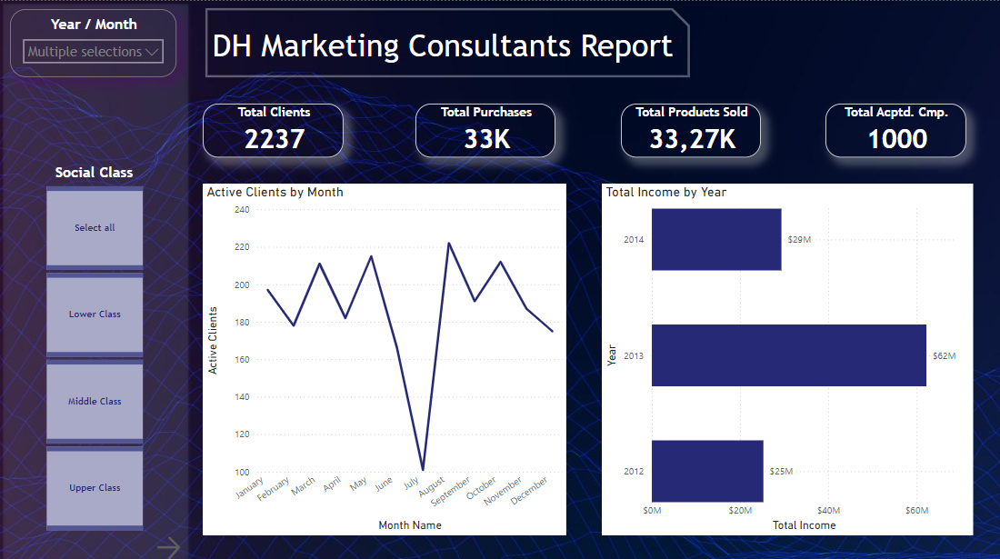

# Power BI Marketing Consultant Report

## Overview

This repository contains a **Power BI** report focused on marketing analysis. The report provides key insights into the performance of various marketing campaigns, customer segmentation, and overall business growth strategies. The visualizations and data analysis in the report help decision-makers understand key trends and make data-driven decisions.

### Key Insights:
- **Campaign Performance**: Track the effectiveness of marketing campaigns across different channels.
- **Customer Segmentation**: Analyze different customer segments based on demographics, purchase history, and engagement metrics.
- **ROI Analysis**: Measure the return on investment (ROI) for various marketing initiatives and their impact on business growth.
- **Sales Growth Trends**: Visualize how marketing strategies influence sales growth over time.

## Report File

- **File**: `Marketing_consultant_report.pbix`
- **Software**: Power BI Desktop

### Visualizations:

1. **Campaign Performance Dashboard**: Provides an overview of different marketing campaigns, including engagement metrics and conversion rates.
2. **Customer Segmentation Analysis**: Displays customer data segmented by various demographics, behavior patterns, and product preferences.
3. **Sales & Revenue Trends**: A time-based analysis of how marketing efforts affect overall sales and revenue figures.
4. **ROI Dashboard**: Visual representation of the return on investment for each marketing strategy.

## Data Sources

The data used in this Power BI report comes from various internal and external sources, including:
- Customer relationship management (CRM) data.
- Marketing platform performance data (e.g., email campaigns, social media analytics).
- Sales data from financial reports.

## Conclusion

This report is designed to assist marketing teams and decision-makers in evaluating the success of their campaigns and identifying opportunities for improvement. It provides valuable insights into how customer segmentation and marketing efforts contribute to business growth.

---

### Author

- **Miquel Serra González**

## License

This project and its content are protected by copyright. All rights reserved. Unauthorized use, distribution, or modification of the content within this report is prohibited without prior permission from the author.
